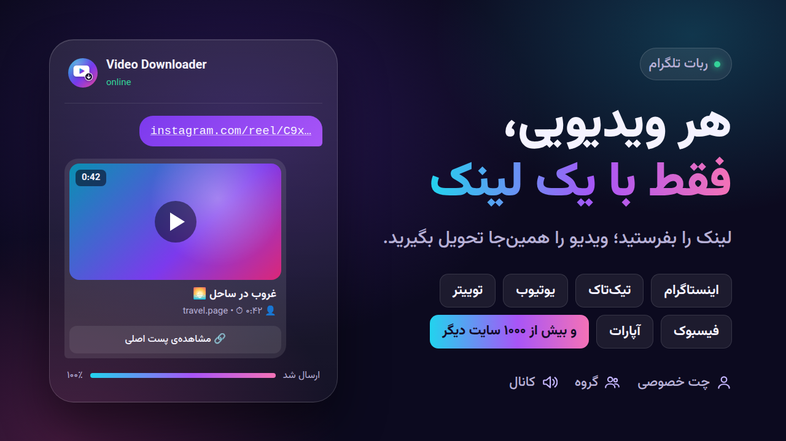

# ربات دانلود ویدیو تلگرام

**نسخهٔ دانلودر عمومی با پنل آمار:** راهنمای فعال‌سازی جدید در [ACTIVATION.md](ACTIVATION.md).
پنل خصوصی در `/admin.html`؛ کلیدهای `ADMIN_TOKEN` و `ANALYTICS_SALT` برای انتشار نسخهٔ جدید لازم هستند.
اشتراک پولی هنوز فعال نشده است.



یک ربات تلگرام که هر لینکی از **اینستاگرام، تیک‌تاک، یوتیوب، توییتر (X)، فیسبوک، ردیت، پینترست، آپارات** و
[بیش از هزار سایت دیگر](https://github.com/yt-dlp/yt-dlp/blob/master/supportedsites.md) برایش بفرستید را
دانلود می‌کند و خود ویدیو را برایتان می‌فرستد.

دانلود با [yt-dlp](https://github.com/yt-dlp/yt-dlp) و ارتباط با تلگرام با
[python-telegram-bot](https://python-telegram-bot.org) انجام می‌شود.

## امکانات

- فقط لینک را بفرستید؛ چند لینک در یک پیام هم پشتیبانی می‌شود (تا ۵ لینک)
- **هر کسی می‌تواند ربات را به گروه یا کانال خودش اضافه کند**؛ ربات زیر هر لینک ویدیویی، خود ویدیو را می‌فرستد
- **وب‌سایت** روی دامنه‌ی خودتان (مثلاً `dl.gryffin.uk`) با HTTPS خودکار: لینک بگذارید، پیشرفت را ببینید، ویدیو را پیش‌نمایش و ذخیره کنید
- پست‌های چندتایی (کاروسل) اینستاگرام: همه‌ی ویدیوها فرستاده می‌شوند
- ویدیو با فرمت MP4 (H.264) فرستاده می‌شود تا در همه‌ی دستگاه‌ها داخل تلگرام پخش شود
- اگر ویدیو از محدودیت حجم تلگرام بزرگ‌تر باشد، خودکار با کیفیت پایین‌تر (۴۸۰، ۳۶۰، ۲۴۰) دوباره امتحان می‌کند
- چند دانلود هم‌زمان برای چند کاربر
- امکان محدود کردن ربات به کاربران، گروه‌ها یا کانال‌های مشخص
- پشتیبانی از پروکسی و فایل کوکی (برای اینستاگرام)
- ظاهر گرافیکی: بنر خوشامد با دکمه‌ها، نوار پیشرفت زنده‌ی دانلود، کپشن مرتب (عنوان، سازنده، مدت) و دکمه‌ی «مشاهده‌ی پست اصلی» زیر هر ویدیو
- عکس پروفایل و توضیحات ربات خودکار تنظیم می‌شود
- **دو زبانه (انگلیسی و فارسی)**: هر کاربر خودکار زبان تلگرام یا مرورگر خودش را می‌بیند (فارسی برای فارسی، انگلیسی برای بقیه)
  و با دکمه یا دستور `/lang` می‌تواند عوض کند. اعداد فارسی در حالت فارسی.

## ۱. ساخت ربات در تلگرام

1. در تلگرام به [@BotFather](https://t.me/BotFather) پیام بدهید و دستور `/newbot` را بفرستید.
2. یک اسم و یک یوزرنیم (که به `bot` ختم شود) انتخاب کنید.
3. توکنی که می‌دهد (شبیه `123456789:ABC...`) را نگه دارید.
4. برای اینکه ربات در گروه‌ها همه‌ی لینک‌ها را ببیند (پیشنهادی):
   در BotFather دستور `/setprivacy` را بفرستید، ربات را انتخاب کنید و **Disable** را بزنید.
   (توضیح بیشتر در بخش «گروه‌ها و کانال‌ها» پایین‌تر)

## ۲. تنظیمات

```bash
cp .env.example .env
```

فایل `.env` را باز کنید و حداقل `BOT_TOKEN` را پر کنید:

| متغیر | توضیح | پیش‌فرض |
|---|---|---|
| `BOT_TOKEN` | توکن ربات از BotFather (**الزامی**) | — |
| `DEFAULT_LANGUAGE` | زبان کانال‌ها و کاربرانی که زبان اپشان معلوم نیست: `en` یا `fa` | `en` |
| `DOMAIN` | آدرس وب‌سایت، مثلاً `dl.gryffin.uk` (بخش «وب‌سایت روی دامنه») | خالی |
| `ALLOWED_USERS` | آیدی‌هایی که اجازه دارند (با کاما جدا کنید). **خالی = همه** (برای اینکه هر کسی بتواند ربات را به گروه/کانالش اضافه کند، خالی بگذارید). آیدی کاربر (از [@userinfobot](https://t.me/userinfobot)) یعنی آن شخص همه‌جا؛ آیدی گروه یا کانال (با `-100` شروع می‌شود) یعنی همه‌ی اعضای آن | خالی |
| `MAX_FILE_SIZE_MB` | حداکثر حجم فایل. سرور عمومی تلگرام حداکثر ۵۰ مگابایت قبول می‌کند | `49` |
| `VIDEO_MAX_HEIGHT` | بیشترین کیفیت ویدیو (مثلاً `1080`، `720`، `480`) | `720` |
| `MAX_ITEMS_PER_LINK` | حداکثر تعداد فایل از یک لینک (مثلاً کاروسل اینستاگرام) | `10` |
| `MAX_CONCURRENT_DOWNLOADS` | تعداد دانلود هم‌زمان | `3` |
| `COOKIES_FILE` | مسیر فایل `cookies.txt` برای سایت‌هایی که لاگین می‌خواهند | خالی |
| `PROXY` | پروکسی برای تلگرام و دانلود، مثلاً `socks5://127.0.0.1:1080` | خالی |
| `BOT_API_URL` / `BOT_API_FILE_URL` | آدرس سرور شخصی Bot API (برای فایل‌های تا ۲ گیگابایت) | خالی |
| `WEB_MAX_FILE_SIZE_MB` | حداکثر حجم هر فایل در وب‌سایت | `300` |
| `WEB_VIDEO_MAX_HEIGHT` | بیشترین کیفیت ویدیو در وب‌سایت | `1080` |
| `WEB_FILE_TTL_MINUTES` | فایل‌های وب‌سایت بعد از این مدت از سرور پاک می‌شوند | `30` |

## ۳. اجرا

بدون سرور هم می‌شود: بخش «اجرا روی Cloudflare» را ببینید.

### سریع‌ترین راه: یک دستور روی سرور

روی یک سرور اوبونتو (VPS) که با کاربر root وارد آن شده‌اید (از ویندوز: `ssh root@آی‌پی-سرور` در PowerShell):

```bash
curl -fsSL https://raw.githubusercontent.com/alidehghan987654321-rgb/dari/refs/heads/claude/telegram-video-downloader-bot-xwpwbv/install.sh | bash
```

این دستور داکر را نصب می‌کند، کد را در `/opt/dari` می‌گذارد، توکن ربات و آدرس سایت را می‌پرسد، ربات و سایت و HTTPS را
روشن می‌کند و در آخر دقیقاً می‌گوید چه رکورد DNSی در Cloudflare بسازید. اجرای دوباره‌اش همه‌چیز را آپدیت می‌کند
و تنظیمات را نگه می‌دارد.

### روش اول: Docker (پیشنهادی)

```bash
docker compose up -d --build
docker compose logs -f   # دیدن لاگ‌ها
```

این دستور سه چیز را روشن می‌کند: ربات (`bot`)، وب‌سایت (`web`) و Caddy (`caddy`) که HTTPS سایت را درست می‌کند.

### روش دوم: پایتون

به Python 3.11 یا جدیدتر و [ffmpeg](https://ffmpeg.org/download.html) نیاز دارید
(در اوبونتو: `sudo apt install ffmpeg`). بدون ffmpeg هم کار می‌کند ولی کیفیت بعضی ویدیوها (مثلاً یوتیوب) پایین‌تر می‌شود.

```bash
python3 -m venv .venv
source .venv/bin/activate        # در ویندوز: .venv\Scripts\activate
pip install -r requirements.txt
python bot.py
```

حالا در تلگرام به ربات خود `/start` بفرستید و یک لینک امتحان کنید.
وب‌سایت را هم می‌توانید جدا اجرا کنید: `uvicorn web:app --port 8000` و بعد http://localhost:8000

## اجرا روی Cloudflare (بدون سرور)

ربات و سایت می‌توانند روی **Cloudflare Containers** اجرا شوند؛ دیگر سرور، SSH و ساختن رکورد DNS لازم نیست.
هر بار که کد در گیت‌هاب تغییر کند، GitHub Actions خودش تست می‌کند، ایمیج داکر را می‌سازد و روی Cloudflare می‌گذارد
(`.github/workflows/deploy-cloudflare.yml`). آدرس سایت `dl.gryffin.uk` است و Cloudflare رکورد DNS و گواهی HTTPS آن را
خودش می‌سازد.

**کارهایی که فقط یک بار لازم است:**

1. **پلن Workers Paid** (حدود ۵ دلار در ماه؛ Containers بدون آن کار نمی‌کند):
   در [dash.cloudflare.com](https://dash.cloudflare.com) ← **Workers & Pages** ← **Plans** ← **Workers Paid**.
2. **API Token:** عکس پروفایل (بالا راست) ← **My Profile** ← **API Tokens** ← **Create Token** ← قالب
   **Edit Cloudflare Workers** ← **Use template**. بعد با **+ Add more** این دسترسی‌ها را هم اضافه کنید:
   - Account ← **Containers** ← Edit
   - Zone ← **DNS** ← Edit
   - Zone ← **Zone** ← Read

   در **Zone Resources** دامنه‌ی `gryffin.uk` را انتخاب کنید ← **Continue to summary** ← **Create Token** و توکن را کپی کنید.
3. **Account ID:** در صفحه‌ی **Workers & Pages**، سمت راست، **Account ID** را کپی کنید.
4. **سه Secret در گیت‌هاب:** در مخزن ← **Settings** ← **Secrets and variables** ← **Actions** ← **New repository secret**:
   - `CLOUDFLARE_API_TOKEN` = توکن مرحله‌ی ۲
   - `CLOUDFLARE_ACCOUNT_ID` = شناسه‌ی مرحله‌ی ۳
   - `BOT_TOKEN` = توکن ربات از BotFather
5. **اجرا:** در مخزن ← **Actions** ← **Deploy to Cloudflare** ← **Run workflow**. اولین بار چند دقیقه طول می‌کشد؛ بعد
   https://dl.gryffin.uk باز می‌شود و ربات جواب می‌دهد.

نکته‌ها:

- روی Cloudflare ربات در حالت **webhook** است: تلگرام پیام‌ها را به `https://dl.gryffin.uk/telegram` می‌فرستد و ربات
  داخل همان کانتینر سایت اجرا می‌شود (`BOT_MODE=webhook` در `web.py`).
- کانتینر بعد از ۳۰ دقیقه بی‌کاری می‌خوابد و با اولین پیام یا بازدید دوباره روشن می‌شود؛ جواب اول بعد از خواب
  چند ثانیه دیرتر می‌آید.
- ربات را هم‌زمان جای دیگری (مثلاً روی VPS با `docker compose`) اجرا نکنید؛ دو نسخه با یک توکن با هم تداخل دارند.
- برای آدرس دیگر، `dl.gryffin.uk` را در `cloudflare/wrangler.jsonc` (دو جا) عوض کنید.
- لاگ‌ها: Cloudflare ← **Workers & Pages** ← `dari` ← **Logs**، یا لاگ اجرای GitHub Actions.

## وب‌سایت روی دامنه (مثلاً dl.gryffin.uk)

با `docker compose up -d --build` وب‌سایت هم کنار ربات بالا می‌آید و Caddy گواهی HTTPS را برای دامنه
خودکار می‌گیرد و تمدید می‌کند. فقط باید دامنه را به سرور وصل کنید:

1. **سرور:** یک VPS (مثل بخش «اجرا»). پورت‌های ۸۰ و ۴۴۳ باید باز باشند
   (اگر فایروال ufw روشن است: `ufw allow 80,443/tcp`).
2. **رکورد DNS در Cloudflare:** در [dash.cloudflare.com](https://dash.cloudflare.com) دامنه‌ی `gryffin.uk` ←
   **DNS** ← **Records** ← **Add record**:
   - Type: `A`
   - Name: `dl`
   - IPv4 address: آی‌پی سرور
   - Proxy status: **DNS only** (ابر خاکستری)

   و **Save**. اگر سرور IPv6 هم دارد، یک رکورد `AAAA` با همین اسم و آی‌پی نسخه‌ی ۶ بسازید.
3. **در `.env`:** `DOMAIN=dl.gryffin.uk`
4. `docker compose up -d --build`
5. یکی دو دقیقه بعد https://dl.gryffin.uk را باز کنید. اگر باز نشد، `docker compose logs caddy` را ببینید.

نکته‌ها:

- اسم زیردامنه دلخواه است (مثلاً `video.gryffin.uk`)؛ فقط Name در Cloudflare و `DOMAIN` در `.env` یکی باشند.
- چرا DNS only؟ Caddy خودش گواهی را از Let's Encrypt می‌گیرد. با ابر نارنجی هم کار می‌کند به شرطی که
  SSL/TLS در Cloudflare روی **Full (strict)** باشد، ولی DNS only ساده‌تر است.
- سایت فقط لینک پست/ویدیو از سایت‌های شناخته‌شده را قبول می‌کند، هر بازدیدکننده هم‌زمان حداکثر ۲ دانلود دارد
  و فایل‌ها بعد از ۳۰ دقیقه از سرور پاک می‌شوند.
- ترافیک دانلودها از سرور شما رد می‌شود؛ اگر حجم ترافیک سرورتان محدود است، `WEB_MAX_FILE_SIZE_MB` را کم کنید.
- وقتی `DOMAIN` تنظیم باشد، دکمه‌ی «🌐 نسخه‌ی وب» به پیام خوشامد ربات اضافه می‌شود و سایت هم دکمه‌های ربات
  تلگرام را نشان می‌دهد.
- برای آپدیت: `git pull && docker compose up -d --build`

## زبان‌ها (انگلیسی و فارسی)

- **ربات:** هر کاربر به زبان اپ تلگرام خودش جواب می‌گیرد: اگر تلگرامش فارسی باشد فارسی، وگرنه انگلیسی.
  با دکمه‌ی «🇮🇷 فارسی / 🇬🇧 English» زیر پیام خوشامد یا دستور `/lang` عوض می‌شود. بنر خوشامد هم برای هر زبان جداست
  (`assets/banner-en.png` و `assets/banner.png`). توضیحات پروفایل ربات و منوی دستورها هم برای هر دو زبان تنظیم می‌شود.
- **گروه‌ها:** به زبان کسی که پیام را فرستاده؛ پیام خوشامد به زبان کسی که ربات را اضافه کرده.
- **کانال‌ها:** `DEFAULT_LANGUAGE` (پیش‌فرض انگلیسی).
- **وب‌سایت:** اگر زبان اول مرورگر فارسی باشد فارسی و راست‌به‌چپ، وگرنه انگلیسی؛ دکمه‌ی «فارسی / English»
  بالای صفحه عوضش می‌کند و انتخاب یادش می‌ماند.
- متن‌های ربات در `ui.py` و متن‌های سایت در `static/i18n.js` کنار هم برای هر دو زبان نوشته شده‌اند.

## ظاهر ربات

- **`/start`**: بنر خوشامد (`assets/banner.png`) با دکمه‌های «➕ افزودن به گروه»، «📢 افزودن به کانال» و «📖 راهنما».
  دکمه‌ی راهنما همان پیام را به صفحه‌ی راهنما تبدیل می‌کند و «🔙 بازگشت» برش می‌گرداند.
- **هنگام دانلود**: یک پیام وضعیت که زنده به‌روز می‌شود:
  «🔎 در حال بررسی لینک» ← نوار پیشرفت `██████░░░░░░ ۵۰٪` با حجم و سرعت ← «📤 در حال ارسال» و در پایان پاک می‌شود.
- **زیر هر ویدیو**: عنوان، نام سازنده، مدت ویدیو، امضای `@ربات` (به‌جز در کانال‌ها) و دکمه‌ی «🔗 مشاهده‌ی پست اصلی».
- **پروفایل ربات**: اولین بار که ربات اجرا می‌شود، اگر عکس پروفایل و توضیحات نداشته باشد، خودش
  `assets/avatar.png` را عکس پروفایل می‌کند و متن «درباره‌ی ربات» و توضیح کوتاه را تنظیم می‌کند.
  اگر خودتان در BotFather چیزی گذاشته باشید، دست نمی‌خورد.
- **عکس توضیحات (اختیاری)**: عکسی که کاربر قبل از زدن Start می‌بیند فقط از BotFather تنظیم می‌شود:
  `/mybots` ← ربات ← **Edit Bot** ← **Edit Description Picture** و فایل `assets/description-en.png` (انگلیسی) یا
  `assets/description.png` (فارسی) را بفرستید (۶۴۰×۳۶۰).

متن‌ها و دکمه‌ها همه در `ui.py` هستند. منبع تصاویر (HTML) در `assets/design/` است؛ اگر متنش را عوض کردید،
فایل HTML را در مرورگر باز کنید و از آن اسکرین‌شات بگیرید (بنر ۱۲۸۰×۷۲۰، آواتار ۶۴۰×۶۴۰).

## گروه‌ها و کانال‌ها

وقتی `ALLOWED_USERS` خالی باشد، هر کسی می‌تواند ربات را به گروه یا کانال خودش اضافه کند.
با `/start` در چت خصوصی ربات، دو دکمه‌ی **«➕ افزودن به گروه»** و **«📢 افزودن به کانال»** نمایش داده می‌شود.

### گروه

- هر لینک ویدیویی (اینستاگرام، تیک‌تاک، یوتیوب و ...) که در گروه فرستاده شود، ربات خود ویدیو را در جواب همان پیام می‌فرستد.
- لینک‌های معمولی (سایت‌ها، گیت‌هاب، لینک‌های تلگرام و ...) و لینک پیج/کانال/پلی‌لیست نادیده گرفته می‌شوند تا گروه شلوغ نشود.
- در حالت خودکار ربات فقط وقتی حرف می‌زند که ویدیو را دارد؛ اگر دانلود نشد، ساکت می‌ماند.
- دستور `/dl لینک` (یا ریپلای `/dl` روی پیامی که لینک دارد) همیشه کار می‌کند و اگر دانلود نشد، دلیلش را می‌گوید.
- وقتی ربات به گروه اضافه می‌شود، یک پیام خوشامد با راهنما می‌فرستد. `/help` هم همین راهنما را نشان می‌دهد.

**مهم — حالت حریم خصوصی (Privacy mode):** تلگرام به‌طور پیش‌فرض به ربات‌ها در گروه فقط دستورها (مثل `/dl`) را نشان
می‌دهد. برای دانلود خودکار همه‌ی لینک‌ها یکی از این دو کار لازم است:

1. **یک بار برای همیشه (پیشنهادی، کار مدیر ربات):** در [@BotFather](https://t.me/BotFather) دستور `/setprivacy` ← ربات ←
   **Disable**. بعد از این تغییر، ربات را از گروه‌هایی که از قبل در آن‌ها بوده حذف و دوباره اضافه کنید.
2. **برای هر گروه (کار صاحب گروه):** ربات را ادمین گروه کنید (هیچ دسترسی خاصی لازم نیست).

ربات موقع اجرا اگر Privacy mode روشن باشد در لاگ هشدار می‌دهد. اگر هم در BotFather گزینه‌ی `/setjoingroups` خاموش باشد،
کسی نمی‌تواند ربات را به گروه اضافه کند؛ باید روشن (Enable) باشد (پیش‌فرض روشن است).

### کانال

- ربات را به‌عنوان **ادمین** با دسترسی **«ارسال پیام» (Post Messages)** به کانال اضافه کنید (دکمه‌ی «افزودن به کانال» همین دسترسی را درخواست می‌کند).
- هر پستی که لینک ویدیو داشته باشد، ربات ویدیو را در جواب همان پست در کانال می‌فرستد.
- در کانال هیچ پیام «در حال دانلود» یا پیام خطایی فرستاده نمی‌شود تا برای اعضای کانال نوتیفیکیشن اضافه نرود.
- کسی که ربات را به کانال اضافه کرده، یک پیام تأیید در چت خصوصی ربات می‌گیرد (اگر قبلاً ربات را استارت کرده باشد).
- اگر کانال گروه گفتگو (Discussion) داشته باشد و ربات در آن هم باشد، ویدیو دوبار فرستاده نمی‌شود.

## نکته‌های مهم

### اجرا از داخل ایران

تلگرام، اینستاگرام، یوتیوب و ... در ایران فیلتر هستند، پس ربات باید یا روی یک **سرور خارج از ایران** (VPS) اجرا شود
(ساده‌ترین راه)، یا با متغیر `PROXY` به یک پروکسی وصل شود. هم پروکسی `socks5://` و هم `http://` پشتیبانی می‌شود.

### اینستاگرام و فایل کوکی

اینستاگرام خیلی وقت‌ها بدون لاگین اجازه‌ی دانلود نمی‌دهد (خطای «نیاز به ورود»). راه‌حل:

1. با یک اکانت (ترجیحاً اکانت فرعی) در مرورگر وارد instagram.com شوید.
2. با افزونه‌ای مثل «Get cookies.txt LOCALLY» کوکی‌ها را با فرمت Netscape در فایل `cookies.txt` ذخیره کنید.
3. در `.env` بنویسید `COOKIES_FILE=cookies.txt` (در Docker: `COOKIES_FILE=/app/cookies.txt` و بخش `volumes` در
   `docker-compose.yml` را از حالت کامنت خارج کنید).

فایل کوکی مثل رمز عبور است؛ آن را به کسی ندهید (در `.gitignore` هست و وارد گیت نمی‌شود).

### محدودیت ۵۰ مگابایت

ربات‌ها از طریق سرور عمومی تلگرام حداکثر فایل ۵۰ مگابایتی می‌توانند بفرستند. ربات خودش کیفیت را پایین می‌آورد تا
فایل جا شود. برای فایل‌های بزرگ‌تر (تا ۲ گیگابایت) باید
[سرور Bot API را خودتان اجرا کنید](https://github.com/tdlib/telegram-bot-api) و `BOT_API_URL`،
`BOT_API_FILE_URL` و `MAX_FILE_SIZE_MB` (مثلاً `2000`) را تنظیم کنید.

### اگر دانلود از یک سایت خراب شد

سایت‌ها مدام تغییر می‌کنند و yt-dlp مرتب به‌روز می‌شود. اول yt-dlp را آپدیت کنید:

```bash
pip install -U "yt-dlp[default,curl-cffi,deno]"   # اجرای مستقیم با پایتون
docker compose build --no-cache && docker compose up -d   # Docker
```

## تست‌ها

```bash
pip install -r requirements-dev.txt
pytest
```
